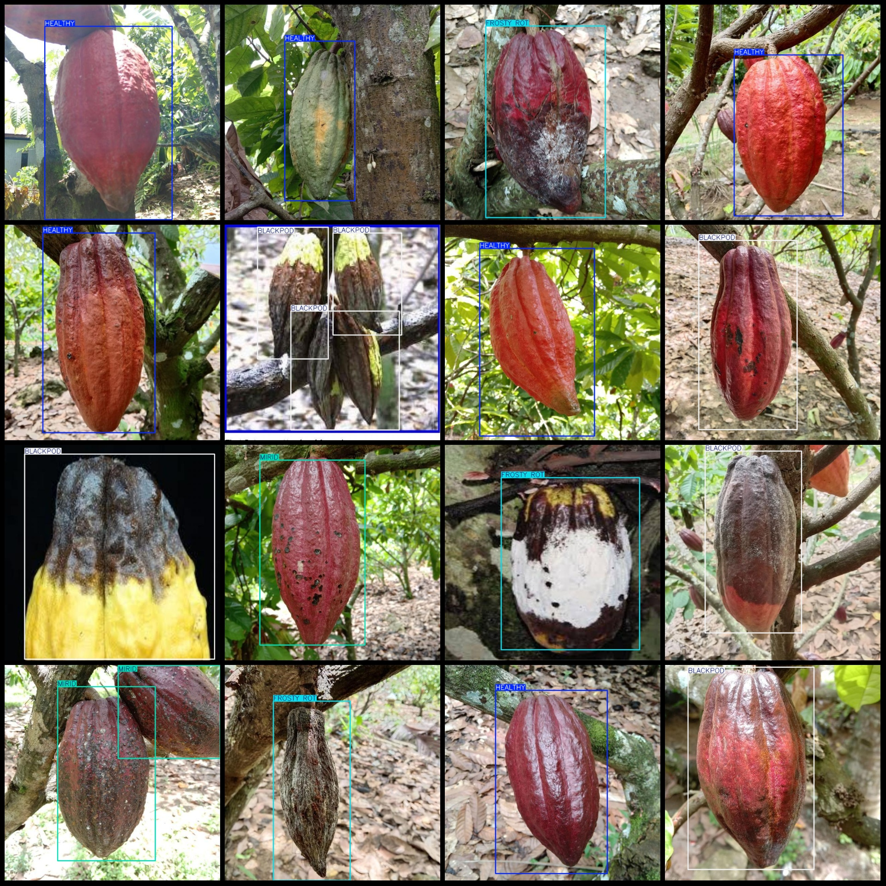
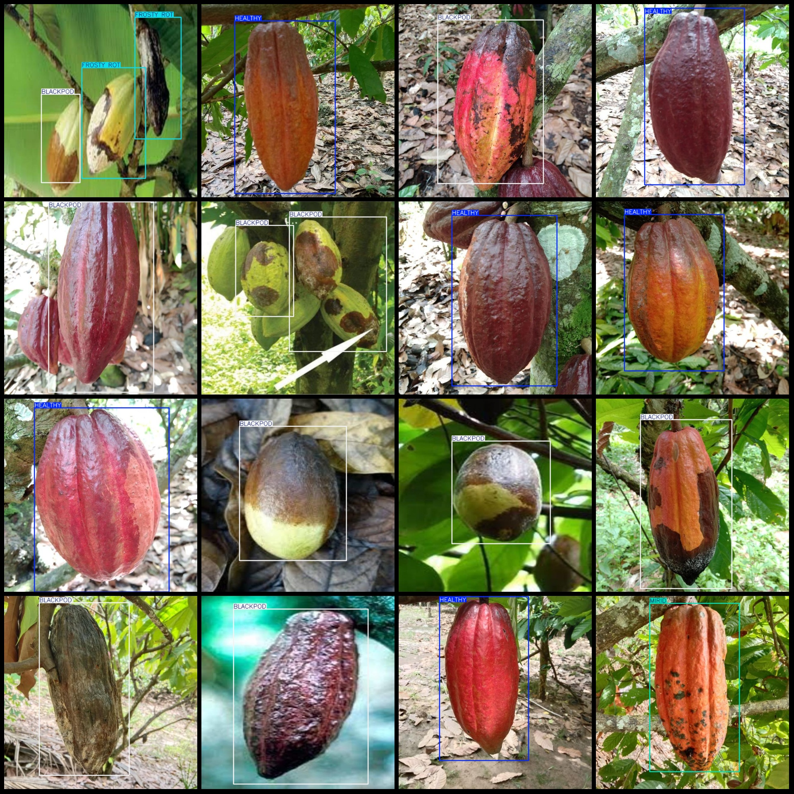

# Cocoa Bean Disease and Defect Detection Dataset in VOC+YOLO format with 1744 images across 4 categories

Dataset format: Pascal VOC format + YOLO format (without split path in txtfile, only contain jpgimage and corresponding VOC format xmlfile and yolo format txtfile)
number of images: 1744  
annotation count: 1744  
annotation count: 1744  
annotationnumber of classes: 4  
Annotation class names (notice that the order in the YOLO format is not consistent with this, but is based on the labels file's classes.txt): ["BLACKPOD", "FROSTY ROT", "HEALTHY", "MIRID"]
boxes per class:   
BLACKPOD (Black Pod Disease) box count = 440  
FROSTY ROT (Frost Rot) box count = 336  
HEALTHY (Healthy) box count = 732  
MIRID (Mirid Fly Pest) box count = 521
total boxes: 2029  
images per class:   
Black pod disease (BLACKPOD) images = 404
Frost rot (FROSTY ROT) images = 287
Healthy images = 679
Mirid images = 481
image resolution: 640x640  
Use annotation tool: labelImg
Annotation rules: Draw a rectangle around the class.
Important notes: The dataset does not have a separate training, validation, or test set; you need to divide it yourself.
Special statement: This dataset does not guarantee the accuracy of the trained model or weight file.
Image preview:
## Images

Here is a pay link on Stripe ( https://buy.stripe.com/3cs8yP7sY87d0vu9AB ). Please contact me lonlonago@foxmail.com after funding $89, and I will send you a complete data files , thank you!

